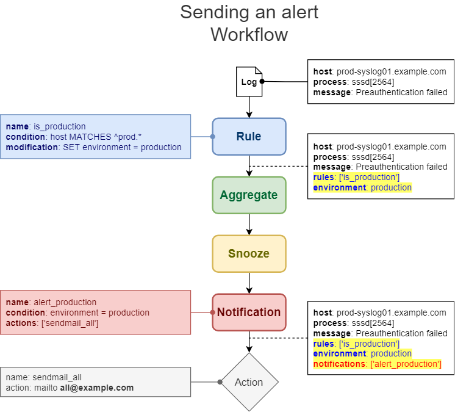
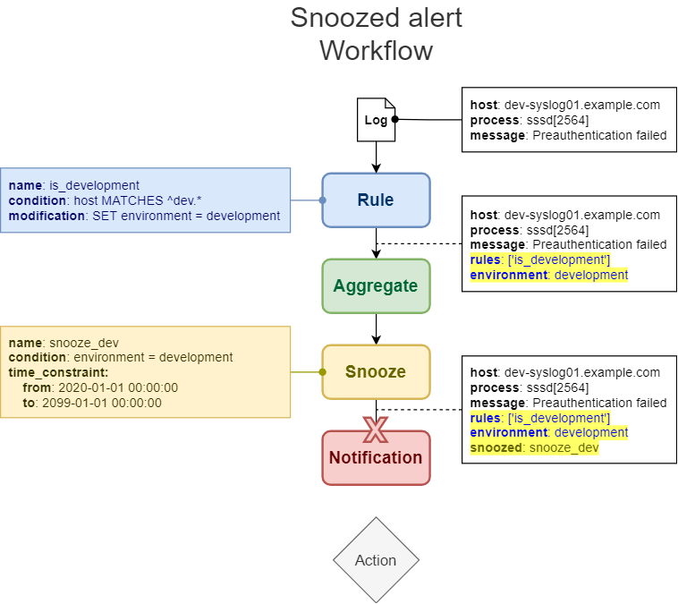

# Architecture

## Overview

Snooze can receive logs from dedicated endpoints called **Webhooks** or from external components called **Input plugins**.

Upon receiving a log, Snooze creates a data structure called **Record** which is actually a dictionary with pre parsed fields.

Records are then being processed through a series of components called **Process plugins**.

The final Process plugin (**Notification**) is used for alerting. It relies on internal and external components called **Action plugins** (sending a mail, executing a script, etc...)

## Input plugins / Webhooks

[How to inject logs into Snooze](04_Inputs.md)

## Process Plugins

A Process plugin receives a Record, processes it then sends it to the next Process plugin. At the moment, Snooze has four Process plugins executed in the following order:

- [Rules](05_Rules.md): Modify records
- [Aggregate Rules](06_AggregatesRules.md): Group records
- [Snooze](07_Snooze.md): Stop alerting
- [Notifications](08_Notifications.md): Alerting

It is worth mentioning that the configuration file `/etc/snooze/server/core.yaml` allows this list to be completely redefined. If one component is not necessary, it can be removed from the list. A new component could also be added in between in the future.

## Action Plugins  (alerting scripts)

[How to use alerting scripts](09_Actions.md)

## Examples

