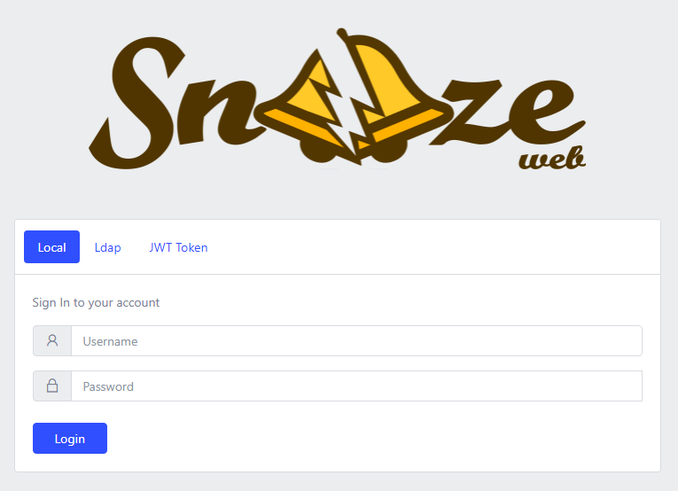

# Log in to the web interface



## URL

By default, the web interface listens on port 5200 under the following URL: http://localhost:5200/web/

## Default Local user 'root'

In case `create_root_user` in `/etc/snooze/core.yaml` has been left to **true** or is **undefined**, a local user named `root` will be automatically created whenever snooze is run for the first time. Its password is `root` and it has admin privileges.

## JWT Token

Otherwise, it is always possible to generate a root token that can be used for **JWT Token** authentication method:
```bash
$ snooze root-token
Root token: eyJ0eXAiOiJKV1QiLCJhbGciOiJIUzI1NiJ9.eyJ1c2VyIjp7Im...
```

## LDAP Authentication

[Configure LDAP Authentication](13_LDAP.md)
