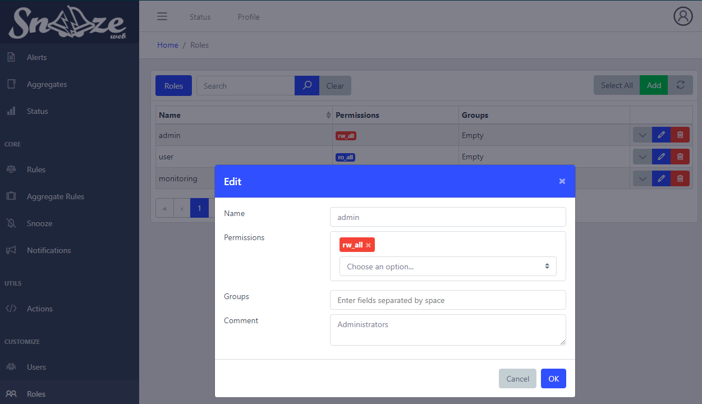
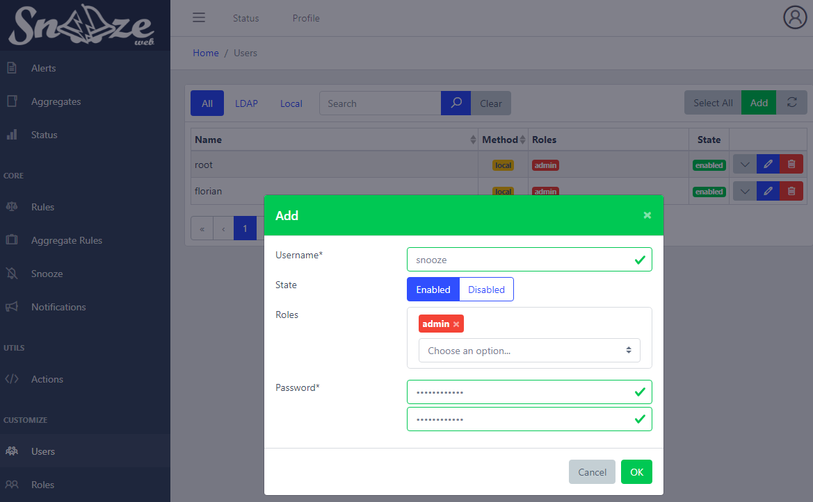
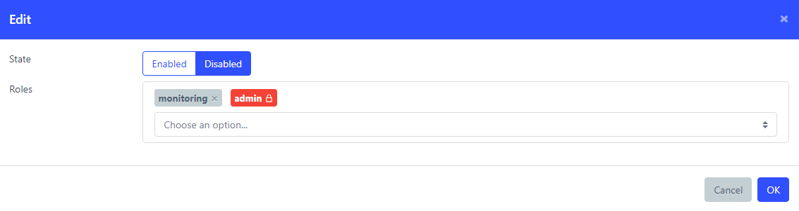

# Users creation and permissions

Only authenticated users with sufficient permissions can interact with Snooze. Permissions are given to users by assigning them Roles.

## Roles

* `Name`*: Name of the role.
* `Permissions`: List of permissions granted by the role.
* `Groups`: List of groups provided by the authentication backend. If a user successfully logs in and is a member of a group, this role will get automatically assigned to the user. [See Static_Roles](#Static_Roles)
* `Comment`: Description

### Permissions

Explanation of all default permissions:
* `rw_all`:  Read and Write for All. Full privileges on any resource in Snooze.
* `ro_all`:  Read Only for All. Can view everything but cannot add/edit/delete anything.
* `rw_X`:  Read and Write for X. Full privileges on resource X.
* `ro_X`:  Read Only for X. Can view everything on resource X but cannot add/edit/delete it.
* `can_comment`: Allow to acknowledge, re-escalate or comment any received alert. [More on Alerts](09_Alerts.md)

## Users

* `Username`*: Account username.
* `Roles`: List of roles assigned to the user.
* `Password`*: When creating a user, this field is required to set up the user's first password. When editing a user, leave it blank to no apply changes to it. Note: for LDAP users, passwords are not displayed.

### Static_Roles

Roles that automatically assigned to a user because of his group membership coming from the authentication backend will appear as locked.  They cannot be removed unless either the Role's groups are changed or the user's group membership is changed.
