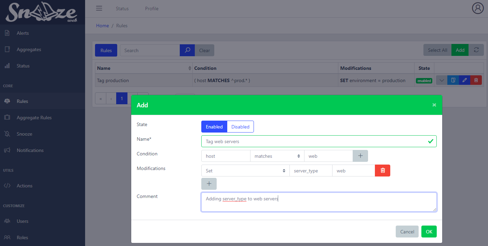

# Rules


## Overview

Add, modify or delete fields from a Record.

Records have to match the Rule's condition in order to being processed.

Rules are very useful to analyze incoming Records and add infos that were not in the original log.

For example:
```yaml
# Record before being processed by Rule
host: prod-syslog01.example.com
```
```yaml
# Rule
name: is_production
condition: host MATCHES ^prod.*
modification: SET environment = production
```
```yaml
# Record after being processed by Rule
host: prod-syslog01.example.com
rules: ['is_production']
environment: production
```
Any Record matching a Rule will have a new field `rules` added with the list of matched Rules.

Rules can have an optional field called `children` which can hold a list of Rules. These Rules will be processed the same way Rules are but only if the parent's condition has been correctly matched in the first place.

This design allowing Rules to be nested is very convenient to avoid repeating the same conditions across multiple Rules.

## Web interface ##



* `Name`*: Name of the rule.
* `Condition`: This rule will be triggered only if this condition is matched. Leave it blank to always match.
* `Modifications`: List of changes to apply to the Record.
	- `Set`: Modify field. Create it if it does not exists.
	- `Delete`: Delete field.
	- `Append (to array)`: Append an element to an array field.
	- `Delete (from array)`: Delete an element from an array field if it exists.
	- `Template`: Same as `Set` but use Jinja templates to render the Record's fields.
	   Example: ["Template", "environment", "{{ env }}"] will create a new field **environment** using the content of the field  **env**.
* `Comment`: Description.

**Note**: How to access a Rule's children:

![Rules](images/web_rules_children.png
