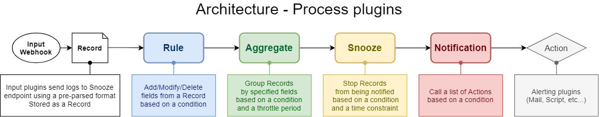
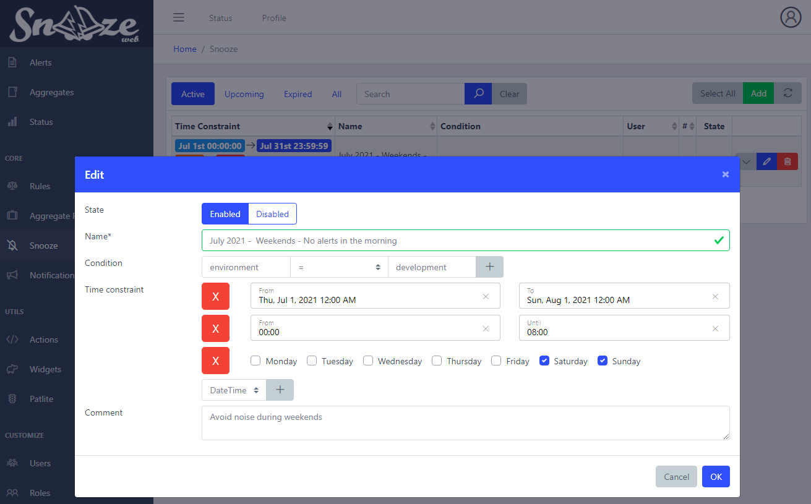

# Snooze



## Overview

Stop Records from being notified.
Records have to match the Snooze filter's condition in order to being processed.
Additionally, a Record timestamp has to be between the Snooze filter's starting time and end time in order to being processed.
Snooze filters are especially useful to reduce noise in case a Record does not need to be notified. It can be because it was not a critical issue after all or if the escalating time itself is not considered critical.

For example:
```yaml
# Record before being processed by Snooze
host: dev-syslog01.example.com
rules: ['is_development']
environment: development
```
```yaml
# Snooze
name: snooze_dev
condition: environment = development
time_constraint:
    from: 2020-01-01 00:00:00
    to: 2099-01-01 00:00:00
```
```yaml
# Record after being processed by Snooze
host: dev-syslog01.example.com
rules: ['is_development']
environment: development
snoozed: snooze_dev
```

The Record matched the Snooze filter, therefore it was not be passed to the next Process plugin.
Any Record matching a Snooze filter will have a new field `snoozed` added with the Snooze filter name.

## Web interface ##



* `Name`*: Name of the snooze filter.
* `Condition`: This rule will be triggered only if this condition is matched. Leave it blank to always match.
* `Time Constraint`: From which date to which date this snooze filter will be active
* `Comment`: Description.
