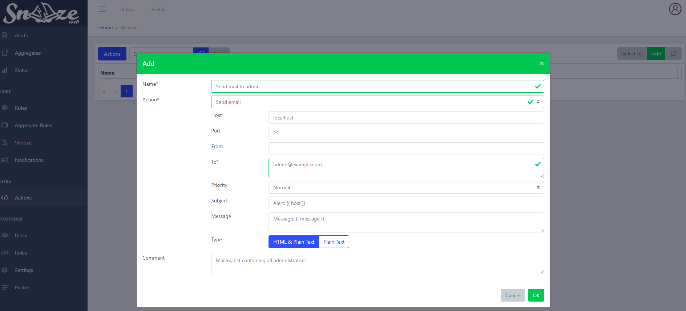
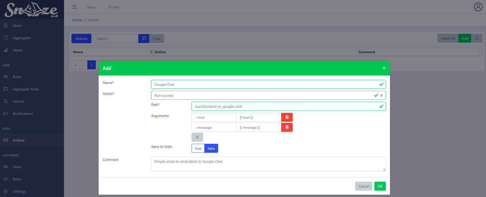

# Alerting scripts (Actions)


## Overview

Execute a command when called. Right now only **Notifications** can call an Action.

Internal Actions are being shipped with `snooze-server` package.

External Actions can be found and installed from [Snooze Plugins Repository](https://github.com/snoozeweb/snooze_plugins)

## How to enable/disable Actions

Actions are managed in `/etc/snooze/server/core.yaml`:
```yaml
action_plugins:
    - mail
    - script
```
will load both **mail** and **script** Actions

## Internal Actions

### Mail

Send a mail



* `Host` (`localhost`): Mail server address.
* `Port` (`25`): Mail server port.
* `From` (`''`): Sender address. Can be empty.
* `To` (`''`)*: Comma separated list of recipient addresses.
* `Priority` (`Normal`): Email priority (from Lowest | Low | Normal | High | Highest).
* `Subject` (`Alert: {{ host }}`): Email subject. Can use Jinja templates.
* `Message` (`Message: {{ message }}`): Email content. Can use Jinja templates.
* `Type` (`html`): Email formatting (from HTML & Plain Text | Plain Text).

### Script

Execute a script



* `Script`*: Fully qualified path of the script to execute.
* `Arguments`: List of arguments to provide to the script.
* `Json` (`No`): Send the record as JSON to the script Stdin.
