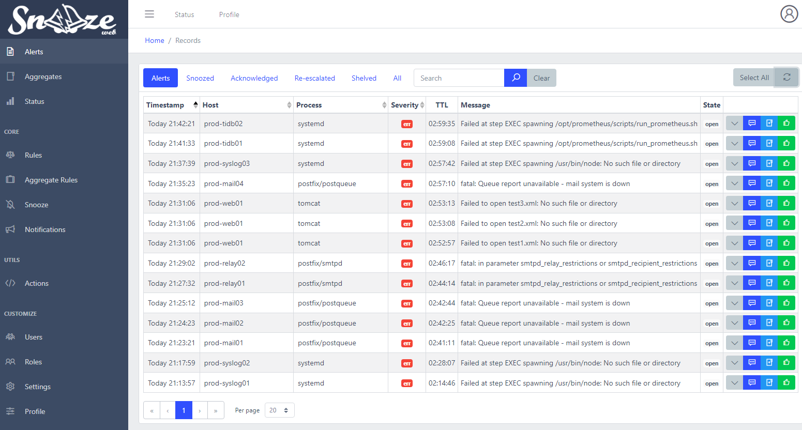

# Manage alerts

## Overview

Records that have not been [aggregated](06_AggregateRules.md) or [snoozed](07_Snooze.md) will be displayed under the first tab of the **Alerts** section on the web interface.

Record that have not been aggregated but snoozed will be displayed under the **Snoozed** tab in the same section.

While these alerts will be automatically cleaned up by the [Housekeeper](12_Housekeeping.md) after a certain period of time, it is still important to properly take care of them. This page will list all the tools available to manage alerts.

## Alert states

User interaction allows an alert to switch between states. Here are the different states an alert can have:
* `open`: A new alert will always have its initial state set to open, meaning nobody interacted with it yet.
* `ack`: [Acknowledged](#Acknowledge). 
* `esc`: [Re-escalated](#Re-escalate). 

## Acknowledge

A new alert
