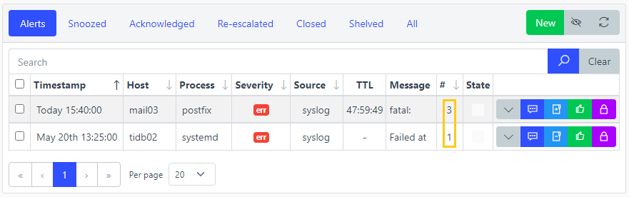
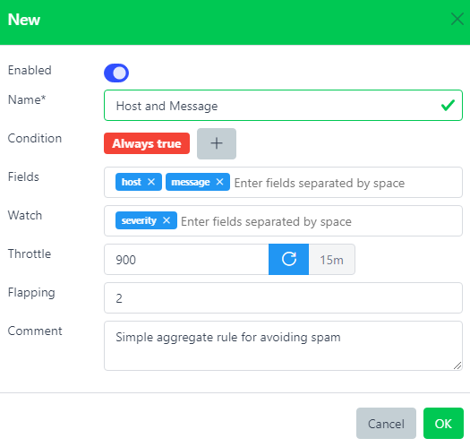

# Aggregate Rules


## Overview

Group Alerts based on matching fields and a throttle period.

Alerts have to match the Aggregate's condition in order to being processed.

Aggregate rules are mainly designed to prevent similar Alerts from being notified especially if they were sent in burst or the process generating them was flapping.

``` yaml
# Alert A
host: prod-syslog01.example.com
process: sssd[2564]
message: Preauthentication failed
timestamp: 2021-01-01 10:00:00

# Alert B
host: prod-syslog01.example.com
process: sssd[2566]
message: Preauthentication failed
timestamp: 2021-01-01 10:10:00

# Alert C
host: prod-syslog01.example.com
process: sssd[2569]
message: Preauthentication failed
timestamp: 2021-01-01 10:20:00
```

``` yaml
# Aggregate rule
fields:
    - host
    - message
throttle: 900 # 15 mins
```

All three alerts have the same fields `host` and `message`.

Alert A being the first one processed, it was correctly passed to the next Process plugin. The throttle period started from Alert A timestamp.

Alert B was processed 10 minutes after Alert A which was lower than the throttle period (15 mins), therefore Alert B was not passed to the next Process plugin.

Alert C was processed 20 minutes after Alert A which was greater than the throttle period, therefore Alert C was correctly passed to the next Process plugin. The throttle period restarted from Alert C timestamp.

**Note**: On the web interface, it is possible to see how many times an alert was aggregated by checking the number on the very right on **Alerts** page:



## Watch

Normally, during the throttle period, subsequent alerts would not be notified. It is possible though to bypass this behavior by setting up watched fields.

If a new incoming alert that would be aggregated has one of its watched fields changed, the throttle period will be reset and the alert will be notified.

``` yaml
# Alert A
host: prod-syslog01.example.com
severity: critical
timestamp: 2021-01-01 10:00:00

# Alert B
host: prod-syslog01.example.com
severity: emergency
timestamp: 2021-01-01 10:10:00
```

``` yaml
# Aggregate rule
fields:
    - host
watch:
    - severity
throttle: 900 # 15 mins
```

Since `severity` has been set as a watched field, Alert B which would usually not be notified because of the throttle period is getting notified (critical -\> emergency).

## Severity-independent identity

Aggregate identity is determined solely by the rule's `fields` — **not** by severity. Two events that share the same field values will land in the same aggregate regardless of whether their `severity` differs.

This means you should model one rule per **problem type** rather than one rule per severity tier:

```yaml
name: PVC capacity
condition: ["EXISTS", "tarpit_message"]
fields:    [host, tarpit_message]
watch:     [severity]
throttle:  { emergency: 120, critical: 86400, default: 3600 }
```

When the monitoring system sends an `ok`/resolved event (`severity: ok`, `state: close`), it shares the same `host` + `tarpit_message` values, so it matches the **same** aggregate and closes the open alert. A rule that guards its `condition` on a specific severity (e.g. `["=", "severity", "critical"]`) will not match the `ok` event — the resolution falls through to the `default` bucket and the alert is never closed.

### Per-value throttle

`throttle` accepts either:

- **A scalar** (seconds) — applied unconditionally.
- **A map** — each key is matched against the rule's `watch` field values in order; the first match wins. A `default` key is used when no watched value matches.

The example above throttles `emergency` events to 2 minutes, `critical` events to 24 hours, and everything else to 1 hour.

### Re-escalation via `watch`

Setting `watch: [severity]` means that when the severity climbs (e.g. `warning` → `critical`), the throttle resets and the alert is re-notified. Combine this with a per-value `throttle` map to get tighter notification intervals on higher severities without splitting into multiple rules.

:::warning
If you keep separate rules for separate severity tiers (e.g. one rule for `critical` and one for `warning`), merging them into a single severity-agnostic rule will re-fork any in-flight aggregates once — existing counts and throttle windows reset for events that switch to the unified rule.
:::

### Duplicate `fields` rejection

Two **enabled** rules may not share the same `fields` list. If you attempt to create or update a rule whose `fields` duplicate those of another enabled rule, the server returns **HTTP 422**. The server also logs a `WARN` at startup for any pre-existing duplicates.

**Workaround:** add a discriminator field to the condition (e.g. a source tag) so the two rules match disjoint event sets, or collapse them into one rule.

## Flapping

Even during the throttle period, closed alerts getting new hits are being re-opened and therefore notified. However, an anti-flapping feature is present to cap the number of the times this behavior can happen. by default it is set to 3, meaning only 3 subsequent hits can be notified until the throttle period ends.

## Web interface



Name\*  
Name of the aggregate rule.

[Condition](./conditions.md)  
This aggregate rule will be triggered only if this condition is matched. Leave it blank to always match.

Fields  
Space separated fields used to group incoming alerts.

Watch  
Space separated fields used to bypass the throttle period if they get updated.

Throttle  
Number of seconds to wait before escalating the next alert matching this aggregate rule (-1 for infinite).

Flapping  
Maximum number of times to be alerted during the throttle period.

Comment  
Description.

