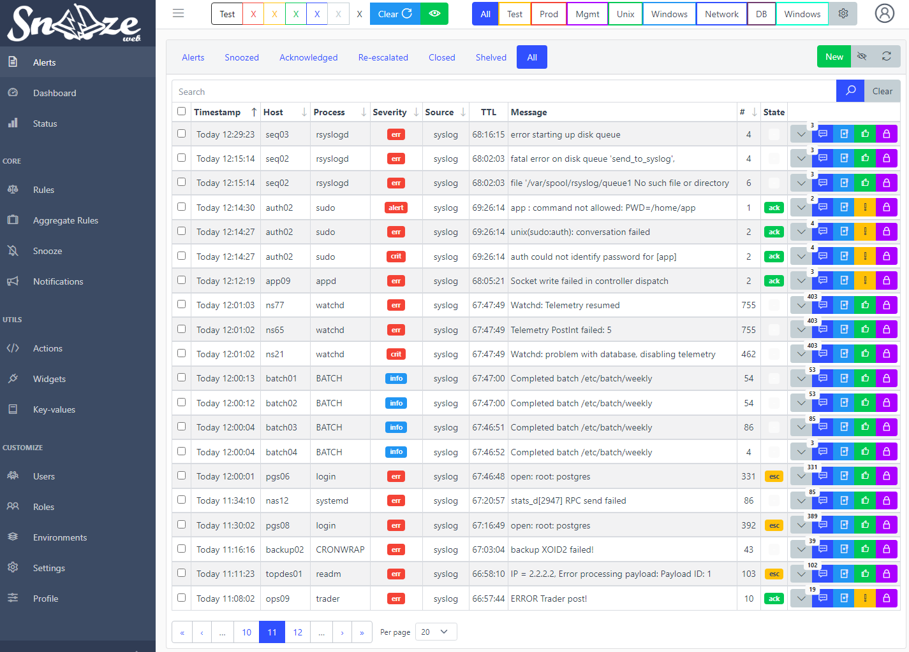
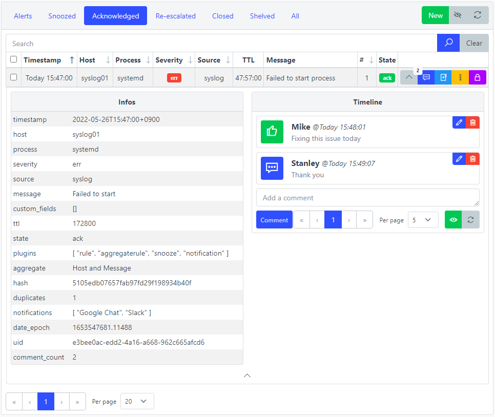

# Manage alerts

## Overview

This page will list all the tools available to manage alerts.

Alerts that have not been [snoozed](./snooze.md), [acknowledged](./alerts.md#acknowledge) or [closed](./alerts.md#close) will be displayed under the first tab of the **Alerts** page on the web interface.

Alerts that have been snoozed will be displayed under the **Snoozed** tab on the same page.

Alerts that have been [re-escalated](./alerts.md#re-escalate) or [re-opened](./alerts.md#re-open) will be displayed under the **Re-escalated** tab on the same page.

Alerts that have been [closed](./alerts.md#close) will be displayed under the **Closed** tab on the same page.

Alerts that have been [shelved](./alerts.md#timeline) will be displayed under the **Shelved** tab on the same page.

## Alert states

User interaction allows an alert to switch between states. Here are the different states an alert can have:

`-`  
A new alert will always have no initial state, meaning nobody has interacted with it yet.

`ack`  
[Acknowledged](./alerts.md#acknowledge).

`esc`  
[Re-escalated](./alerts.md#re-escalate).

`close`  
[Closed](./alerts.md#close).

`open`  
[Re-opened](./alerts.md#re-open).

Expected alert management workflow is: `(esc ->) ack -> close (-> open)`

### Acknowledge

Used to let people know that someone is taking care of the issue related to the alert.

Acknowledged alerts will stop getting [notified](./notifications.md#frequency) if a frequency has been set.

### Re-escalate

After being acknowledged, an alert can get re-escalated.

It can be done automatically by an [aggregate rule](./aggregaterules.md) after the throttle period ended or a field from the watchlist got updated.

It can be done manually by the user to have the alert go through the full processing once more, meaning it can get notified again or snoozed. [Modifications](./rules.md#modifications) can be applied to the alert beforehand.

### Close

Used to let people know that the issue related to the alert is resolved. It is not expected to reoccur anymore.

Alerts can get closed automatically if their **severity** field is in the list of defined **OK Severities** in [Settings](../configuration/index.md)

Closed alerts will stop getting [notified](./notifications.md#frequency) if a frequency has been set. They can be re-opened automatically on a new hit regardless of their [throttle period](./aggregaterules.md).

### Re-open

After being closed, an alert can get re-opened.

It can be done automatically by an [aggregate rule](./aggregaterules.md) if the same alert is observed regardless of the throttle period.

It can be done manually by the user to have the alert go through the full processing once more, meaning it can get notified again or snoozed. [Modifications](./rules.md#modifications) can be applied to the alert beforehand.

## Alerts TTL

Alerts are automatically cleaned up by the [housekeeper](./housekeeping.md) after a certain period of time called **TTL** (Time To Live)

Default TTL is 172800 seconds (2 days). Check the housekeeper page for more information.

### Shelve

A mean to keep some alerts from being deleted is to shelve them. The operation actually deletes their **TTL** field.

## Timeline

By clicking on the grey arrow on an alert, a timeline appears. It contains a history of all events and user interactions related to the alert. There is a possibility to leave a comment as well. An admin can edit or delete any event. By deleting a state event (for example an acknowledgement), the alert goes back to its previous state.

Comments and state changes you make are recorded against your username. The dashboard's **Recent activity** pane lists these attributed user actions, excluding automatic system entries such as escalations and auto-close.

