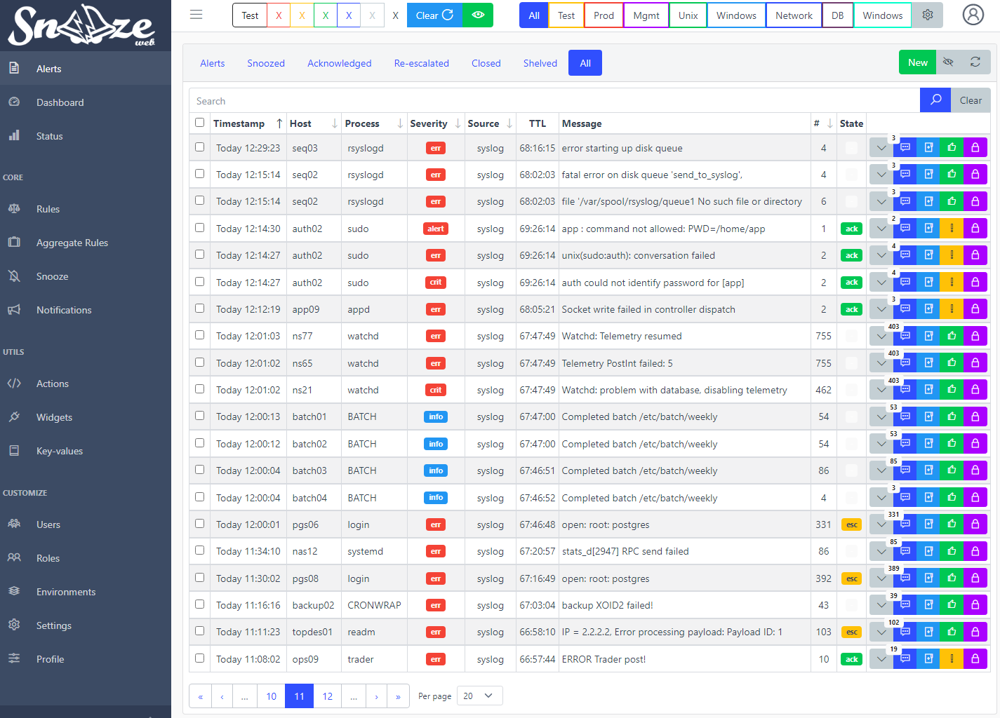
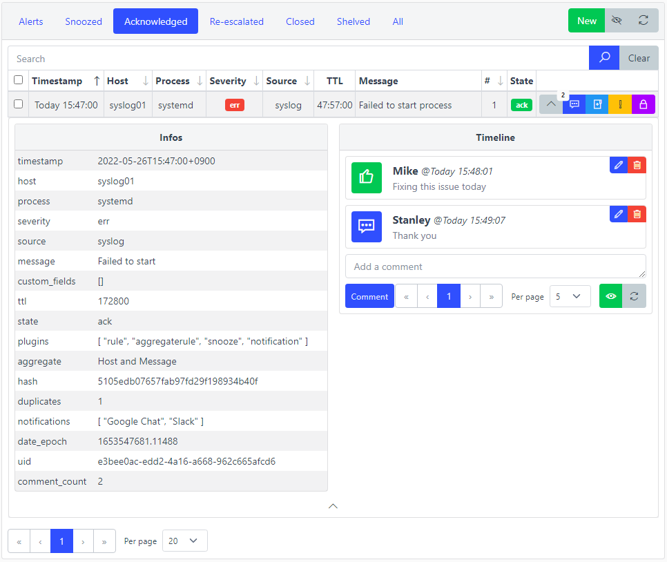

# Manage alerts



## Overview

This page will list all the tools available to manage alerts.

Alerts that have not been [snoozed](./snooze.md), [acknowledged](./alerts.md#acknowledge) or [closed](./alerts.md#close) will be displayed under the first tab of the **Alerts** page on the web interface.

Alerts that have been snoozed will be displayed under the **Snoozed** tab on the same page.

Alerts that have been [re-escalated](./alerts.md#re-escalate) or [re-opened](./alerts.md#re-open) will be displayed under the **Re-escalated** tab on the same page.

Alerts that have been [closed](./alerts.md#close) will be displayed under the **Closed** tab on the same page.

Alerts that have been [shelved](./alerts.md#timeline) will be displayed under the **Shelved** tab on the same page.

## Alert states

User interaction allows an alert to switch between states. Here are the different states an alert can have:

`-`  
A new alert will always have no initial state, meaning nobody has interacted with it yet.

`ack`  
[Acknowledged](./alerts.md#acknowledge).

`esc`  
[Re-escalated](./alerts.md#re-escalate).

`close`  
[Closed](./alerts.md#close).

`open`  
[Re-opened](./alerts.md#re-open).

`shelved`  
[Shelved](./alerts.md#shelve) — temporarily silenced until a timed expiry or
an operator unshelve action.

Expected alert management workflow is: `(esc ->) ack -> close (-> open)`.
Alerts may be shelved from any active state; a shelved alert returns to `open`
automatically on expiry or can be manually unshelved.

### Transition rules

Not every action makes sense from every state. When you post a state-changing
comment (acknowledge, close, re-open, re-escalate) the server checks the move
against the alert's current state and rejects nonsensical transitions with a
`403 Forbidden` error before anything is saved — so you can no longer
double-acknowledge an alert or acknowledge one that is already closed.

The allowed moves are:

- **No state yet (fresh):** can be **acknowledged**, **closed**, or **shelved**.
  It cannot be re-opened (it was never closed) or re-escalated (there is nothing
  to escalate).
- **Acknowledged (`ack`):** can be **closed**, **re-opened**, **re-escalated**,
  or **shelved**. Acknowledging again is rejected.
- **Re-escalated (`esc`):** can be **acknowledged**, **closed**, **re-opened**,
  or **shelved**. Re-escalating again is rejected.
- **Closed (`close`):** can only be **re-opened**. Acknowledging, closing again,
  or re-escalating a closed alert is rejected.
- **Re-opened (`open`):** can be **acknowledged**, **closed**, or **shelved**.
  Re-opening again or re-escalating is rejected.
- **Shelved (`shelved`):** can be **unshelved** (back to `open`),
  **acknowledged**, or **closed** (lifting the shelve early). Posting a new
  `shelve` on an already-shelved alert resets the `shelve_until` deadline.

These rules apply only to state-changing comments. Free-form notes are never
affected, and automatic state changes made by [aggregate rules](./aggregaterules.md)
(such as re-escalation after a throttle period, or re-open on a new hit) follow
the same workflow.

### Action gating

The web UI mirrors the transition table above: actions that would be rejected by
the server (e.g. **Acknowledge** on an already-acknowledged alert, **Re-escalate**
on a fresh alert) are hidden from the kebab menu, quick-action buttons,
right-click context menu, and bulk toolbar. You will not see a button that is
currently illegal for the selected row's state.

The backend 403 remains as a concurrent-change backstop — if another operator
changes an alert's state between the moment you see the page and the moment you
click, the server still rejects the now-stale action and the UI shows an error
toast.

### Ack expiry countdown

When the `housekeeping.ack_timeout` setting is configured, the server stamps an
`ack_until` deadline (epoch seconds) onto each acknowledged alert. The alerts
table shows this deadline as an **"in Xh Ym"** hint next to the username in the
**Acked by** column, so operators can see at a glance how long before the
acknowledgement expires and the alert returns to open.

Rows without a deadline (zero or absent `ack_until`) show no extra text — the
column renders normally.

### Trend indicator

When the aggregaterule plugin processes repeated hits on an existing alert it
stamps a `trend_indication` value reflecting whether the latest severity is
higher, lower, or equal to the previous one:

| Column symbol | `trend_indication` value | Meaning |
|---|---|---|
| `↑` | `moreSevere` | Severity escalated since the last hit |
| `↓` | `lessSevere` | Severity decreased since the last hit |
| `—` | `noChange` / absent | Severity unchanged or no trend data yet |

The `↕` column is sortable by `trend_indication`. Operators who have a
server-configured `console.columns` list must add `"trend"` to their list to see
this column.

### Acknowledge

Used to let people know that someone is taking care of the issue related to the alert.

Acknowledged alerts will stop getting [notified](./notifications.md#frequency) if a frequency has been set.

### Re-escalate

After being acknowledged, an alert can get re-escalated.

It can be done automatically by an [aggregate rule](./aggregaterules.md) after the throttle period ended or a field from the watchlist got updated.

It can be done manually by the user to have the alert go through the full processing once more, meaning it can get notified again or snoozed. [Modifications](./rules.md#modifications) can be applied to the alert beforehand.

### Close

Used to let people know that the issue related to the alert is resolved. It is not expected to reoccur anymore.

Alerts can get closed automatically if their **severity** field is in the list of defined **OK Severities** in [Settings](../configuration/index.md)

Closed alerts will stop getting [notified](./notifications.md#frequency) if a frequency has been set. They can be re-opened automatically on a new hit regardless of their [throttle period](./aggregaterules.md).

### Re-open

After being closed, an alert can get re-opened.

It can be done automatically by an [aggregate rule](./aggregaterules.md) if the same alert is observed regardless of the throttle period.

It can be done manually by the user to have the alert go through the full processing once more, meaning it can get notified again or snoozed. [Modifications](./rules.md#modifications) can be applied to the alert beforehand.

### Acked by

The alert list shows an **Acked by** column with the login of the operator who
last acknowledged the alert. It is a convenience denormalisation: when someone
acknowledges an alert, their login is stamped directly onto the alert record so
the column reads from the same response that populates every other column — no
join against the comment timeline.

- The column shows the acknowledger while the alert is **acknowledged**.
- It is **blank** (`—`) while the alert is open or closed — re-opening or
  closing an alert clears the field.
- It is **retained through re-escalation** (`esc`): the last acknowledger stays
  visible so the team can see who acked before the alert fired again.

Alerts that were already acknowledged before this feature was deployed have no
stored acknowledger and show `—` until they are acknowledged again.

## Bulk operations from the console

The alerts table lets you apply a state change, comment, or attribute/tag update to multiple
alerts at once directly from the web UI.

### Row-select scope

Select one or more rows using the checkboxes. The bulk action bar appears above the table with
buttons for every state transition that is valid for **all** selected rows:

- **Acknowledge / Close / Re-escalate / Re-open** — call `POST /api/v1/record/bulk_state` once
  with a `q` condition built from the selected row UIDs. The success toast shows
  `N alerts updated (M changed)`.
- **Comment** — still posts one `/comment` per selected row (bulk_state does not write per-record
  notes). Use this for the activity feed.
- **Tag / set fields** — opens the tag dialog (see below).

The action bar hides buttons that are invalid for the current selection (e.g. **Acknowledge**
is hidden when all selected rows are closed). When transition eligibility cannot be checked
(select-all-matching mode, see below), all state buttons are shown.

> **Activity-feed caveat.** Bulk state changes (`bulk_state`) do not write a per-alert timeline
> entry — a query can match thousands of rows. The optional message is recorded once in the
> [audit trail](./audit_trail.md). Use the **Comment** action if you need a note visible on each
> alert's individual timeline.

### Select all N matching this filter

When the total result count exceeds the visible page (50 rows) and rows are selected, a
**"Select all N matching this filter"** link appears in the action bar. Clicking it switches
subsequent bulk actions to target every record matching the current tab and search query
instead of just the visible selection — including off-page rows. The action buttons relabel
to show the full count, e.g. `Acknowledge (all 1200)`.

Click **Clear selection scope** to return to the page-only scope.

### Tag / set fields dialog

The **Tag / set fields** button opens a dialog with three sections:

- **Set attributes** — key/value pairs merged onto every matched alert (e.g. `environment=prod`).
- **Add tags** — comma- or space-delimited chips; idempotent (existing tags are not duplicated).
- **Remove tags** — chips to strip from matched alerts.

On submit the dialog calls `POST /api/v1/record/bulk_update` and shows a toast:
`N matched — M set, K tagged, J untagged`.

## Bulk operations across a query

Instead of acting on one alert at a time, you can apply a single change to
**every** alert matching a query in one HTTP call. Both endpoints resolve the
query server-side, apply the change with one database call, and return the
matched/updated counts. They are tenant-scoped: a request only ever touches
alerts in the caller's own tenant.

The query is passed as the `q` parameter — a base64url-encoded JSON
[condition](./querylanguage.md), the same shape the list and search endpoints
use. Omitting `q` matches every alert the caller can see (still constrained to
their tenant).

### Bulk state change

`POST /api/v1/record/bulk_state?q=<condition>` flips the `state` of every
matching alert. Requires the `rw_record` permission.

```bash
curl -X POST "https://<snooze>/api/v1/record/bulk_state?q=<base64url-cond>" \
  -H 'Authorization: Bearer <token>' \
  -d '{"state":"ack","message":"silenced for maintenance"}'
# → {"matched": 47, "updated": 47, "state": "ack"}
```

`state` must be one of `ack`, `close`, `open`, `esc` (the same set used when
[acknowledging](./alerts.md#acknowledge) or [closing](./alerts.md#close) a
single alert); any other value returns `400`. Note: `shelved` is not accepted
by `bulk_state` — use the per-alert timeline endpoint instead (`POST
/api/v1/record/{uid}/comment` with a `shelve` comment type).

> **One behavioural difference from the single-alert path.** Acting on one
> alert posts a comment *and* changes its state. The bulk path changes `state`
> directly and does **not** write one comment per alert — a query can match
> thousands of rows. The optional `message` is recorded once in the
> [audit trail](./audit_trail.md) summary instead.

### Bulk attribute / tag update

`POST /api/v1/{plugin}/bulk_update?q=<condition>` merges attributes and
adds/removes tags across every matching document. Use `record` as the plugin
for alerts. Requires the `rw_{plugin}` permission (e.g. `rw_record`). At least
one of `set`, `tag`, `untag` must be present (an empty body returns `400`), and
the plugin must own a mutable collection (notifiers, the audit log, etc. are
rejected with `404`).

```bash
curl -X POST "https://<snooze>/api/v1/record/bulk_update?q=<base64url-cond>" \
  -H 'Authorization: Bearer <token>' \
  -d '{"set":{"environment":"prod"},"tag":["maint"],"untag":["noisy"]}'
# → {"matched": 12, "set": 12, "tagged": 12, "untagged": 12}
```

The three operations apply in order: `set` (attribute merge) → `tag` (add) →
`untag` (remove). **Adding a tag is idempotent**: an alert already carrying the
tag ends with exactly one copy of it, so re-running the same `tag` request never
produces duplicates.

Both endpoints write one [audit](./audit_trail.md) row per affected alert when
auditing is enabled for the collection (above a server-side cap, a single
summary row carrying the matched count is written instead).

## Alerts TTL

Alerts are automatically cleaned up by the [housekeeper](./housekeeping.md) after a certain period of time called **TTL** (Time To Live)

Default TTL is 172800 seconds (2 days). Check the housekeeper page for more information.

### Shelve

There are two distinct shelve behaviours:

**Permanent shelve.** A means to keep some alerts from being deleted is to shelve
them. The operation actually deletes their **TTL** field (sets `ttl=-1`,
`shelve_until=0`). These alerts are exempt from deletion and have no auto-return —
they stay shelved until an operator acts on them.

**Timed shelve (auto-return).** Posting a `shelve` comment temporarily silences a
single noisy alert: it transitions the record to `state="shelved"` and stamps a
server-controlled `shelve_until = now + housekeeping.shelve_timeout` (default
4h). A minute-cadence housekeeper sweep (`unshelve_timeout`) reverts any shelved
record past its `shelve_until` deadline back to `open`, clears `shelve_until`, and
writes an automatic *"Shelve expired — reverted to open"* timeline comment.
Posting an `unshelve`, `open`, `close`, or `ack` comment lifts the timed shelve
early (clears `shelve_until`). The duration is operator-configurable at runtime in
**Settings → Housekeeping** (`housekeeping.shelve_timeout`).

**Using the UI:** Click **Shelve** in the row action menu to open a duration picker
(default 4 h). Select a preset (1 h / 4 h / 8 h / 24 h / 48 h) or enter a custom
number of hours. Add an optional note and click **Shelve**. To remove a shelve early,
click **Unshelve** in the row action menu.

**Permanent exempt (legacy):** Use **Permanent exempt (legacy)** from the row action
menu to set `ttl=-1`. The alert is excluded from TTL cleanup indefinitely and does not
auto-return. Unlike timed shelve, this does not set `shelve_until` and the alert stays
shelved until an operator acts on it.

**The Shelved tab** shows both timed-shelved alerts (`state=="shelved"`) and legacy
permanent-exempt alerts (`ttl=-1`).

The two behaviours coexist: the auto-return sweep's `shelve_until > 0` guard never
touches a permanent shelve (`shelve_until=0`). A timed shelve leaves `ttl` alone,
so the alert can still expire normally — if its `ttl` is shorter than
`shelve_timeout`, the TTL cleanup job may delete it before the shelve expires.

## Timeline



By clicking on the grey arrow on an alert, a timeline appears. It contains a history of all events and user interactions related to the alert. There is a possibility to leave a comment as well. An admin can edit or delete any event. By deleting a state event (for example an acknowledgement), the alert goes back to its previous state.

Comments and state changes you make are recorded against your username. The dashboard's **Recent activity** pane lists these attributed user actions, excluding automatic system entries such as escalations and auto-close.

## Ingest provenance

The server automatically adds a `source_ip` field to every alert record
received via `POST /api/v1/alerts`. The value is the resolved client IP
(honouring `X-Forwarded-For` and `X-Real-IP` from trusted proxies). If the
posting client supplies its own `source_ip`, the server-resolved value is
not overwritten. Use this field in [Rules](./rules.md) to route or
annotate alerts by origin.

## Maintenance mode (ingest kill-switch)

During an alert flood (an incoming storm that would saturate the pipeline or
fill the database) or a planned maintenance window, you can halt **all** new
alert intake instantly — without restarting the server.

The switch is the `ingest.allow` runtime setting. It defaults to `true`
(ingestion enabled). Set it to `false` and every subsequent
`POST /api/v1/alerts` request **and** every [webhook receiver](./integrations/index.md)
returns `503 Service Unavailable` immediately, rather than dropping the request
silently. The switch is **per-tenant**: suspending one tenant does not affect
the others.

### Disabling intake

From the **Settings** page → **Ingest** tab, toggle **Alert intake enabled** to off and click Save.
Equivalently, via the API:

```bash
curl -X POST https://<snooze>/api/v1/settings \
  -H 'Authorization: Bearer <token>' \
  -d '{"name":"ingest.allow","value":false}'
```

The change takes effect on the next settings read for that tenant (within the
runtime-settings cache window, ≤ 5 seconds).

### Re-enabling intake

Set `ingest.allow` back to `true` (or delete the key) from the Settings page or
the API. Normal `200` responses resume within the same cache window. No restart
is required.

> **Fail-open by design.** If the settings store cannot be read (for example a
> transient database error), the switch defaults to *allow* — a storage hiccup
> never silently locks operators out of alert intake.

