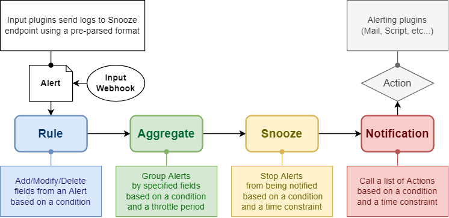
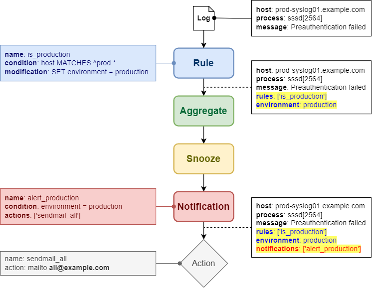
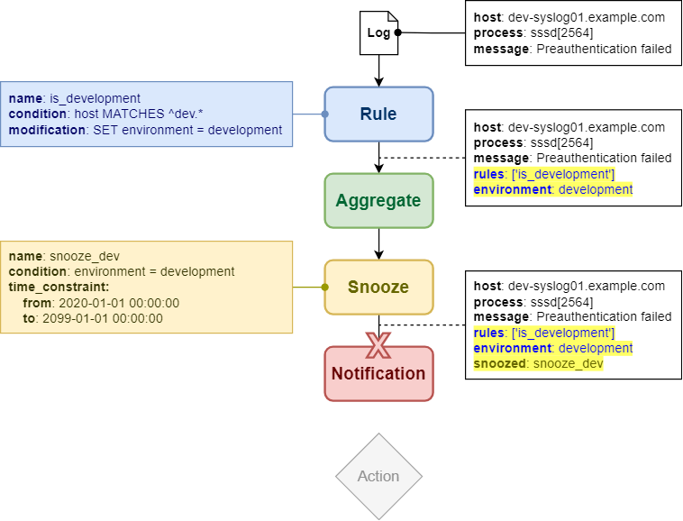

# Architecture

## Overview

Snooze server can receive logs from dedicated endpoints called **Webhooks** or from external components called **Input plugins**.

Upon receiving a log, Snooze server creates a data structure called **Alert** which is actually a dictionary with pre parsed fields.

Alerts are then being processed through a series of components called **Process plugins**.

The final Process plugin (**Notification**) is used for alerting. It relies on internal and external components called **Action plugins** (sending a mail, executing a script, etc...)

## Input plugins / Webhooks

[How to inject logs into Snooze server](./inputs.md)

## Process Plugins

A Process plugin receives an alert, processes it then sends it to the next Process plugin. At the moment, Snooze server has four Process plugins executed in the following order:

[Rules](./rules.md)  
Modify alerts

[Aggregate Rules](./aggregaterules.md)  
Group alerts

[Snooze filters](./snooze.md)  
Stop alerting

[Notifications](./notifications.md)  
Alerting policies

It is worth mentioning that the configuration file `/etc/snooze/server/core.yaml` allows this list to be completely redefined. If one component is not necessary, it can be removed from the list. A new component could also be added in between in the future.

## Action Plugins (alerting scripts)

[How to use alerting scripts](./actions.md)

## Examples

