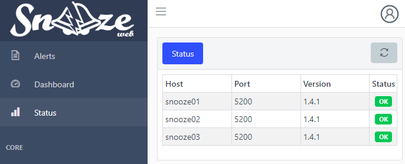

# Clustering

## Overview

To maintain a high availabilty of Snooze server service, it is necessary to have multiple nodes running in a cluster.

Clustering offers a transparent way for the user to replicate all changes done one node's configuration file to all other nodes in the cluster.

:::warning

It is important to not mix up Service HA (snooze-server) and Data HA (database, mongodb). This document is only covering Service HA.

:::

## Configuration

See configuration reference at [Syncer configuration](../configuration/syncer.md).

## Web interface

The status of the running cluster can be seen in the web interface:

