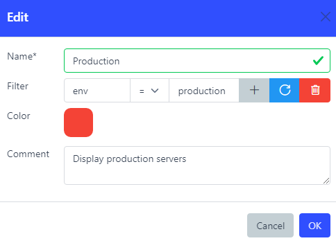

# Environments

## Overview

Environments are a web interface oriented feature allowing users to filter alerts based on a custom [condition](./conditions.md).

They are displayed on the very top on the web interface's Alert page.

Multiple environments can be selected.

## Web interface

Name\*  
Name of the environment

[Condition](./conditions.md)  
Condition used to define the environment

Group  
Group number

Color  
Change the button's display

Comment  
Description

:::note

Use drag&drop to change the display order.

:::

:::note

Environments in **same** groups are additive (OR). Environments in **different** groups are multiplicative (AND).

:::

