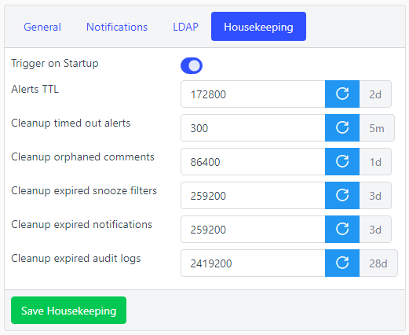

# Housekeeping

## Overview

The housekeeper is a subprocess of Snooze server meant to automatically cleanup data that is not neeeded anymore, preventing Snooze server to grow indefinitely large.

## Configuration

See configuration reference at [Housekeeper configuration](../configuration/housekeeping.md) It can also be configured in the web interface:

