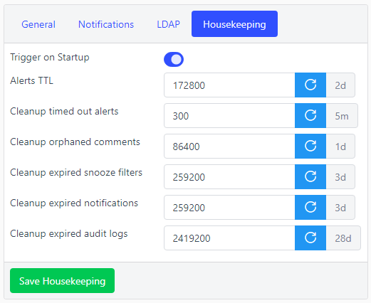

# Housekeeping

## Overview

The housekeeper is a subprocess of Snooze server meant to automatically cleanup data that is not neeeded anymore, preventing Snooze server to grow indefinitely large.

## Configuration

See configuration reference at [Housekeeper configuration](../configuration/housekeeping.md) It can also be configured in the web interface:



## On-demand trigger

The housekeeper normally runs each cleanup job on its own schedule. Operators
can also force a full cycle immediately — useful after a data flood, when
verifying that a retention change takes effect right away, or when debugging a
stuck collection.

```
POST /api/v1/housekeeping/run
```

This fires **every** registered job once, synchronously, in the request, and
returns the per-job results. Both this endpoint and the status probe below
require the `rw_all` permission.

The response is always HTTP `200` — even when individual jobs failed. Failures
are surfaced in each job's `error` field and counted in the top-level `errors`
field:

```json
{
  "status": "ok",
  "jobs": [
    {"name": "cleanup_timeout", "duration_ms": 12},
    {"name": "cleanup_aggregate", "duration_ms": 3},
    {"name": "cleanup_audit", "error": "list tenants: ...", "duration_ms": 1}
  ],
  "errors": 1
}
```

To probe whether the housekeeper is wired (and how many jobs are registered)
before triggering a run:

```
GET /api/v1/housekeeping/status
```

```json
{"status": "ok", "registered_jobs": 8}
```

When the housekeeper is not configured, both endpoints respond with
`503 Service Unavailable`.

