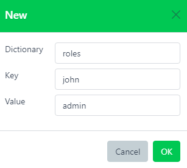

# Key-values

## Overview

Located on the **utils** page of the Web UI, **Key-values** offers a fast and efficient way to store dictionnaries that can be used for mapping alert's specific fields.

Being used as a **Modification** in [Rules](./rules.md#key-value-mapping), **Key-values** are usually used for replacing multiple *condition/set modification* pairs, which not only favors readability but also greatly reduces processing time.

## Web interface

Dictionary\*  
Name of the dictionary

Key\*  
Key of the dictionnary

Value\*  
Value to associate with the key

:::warning

The pair (dictionnary, key) being unique by definition, any duplicate entry will overwrite the previous one

:::

