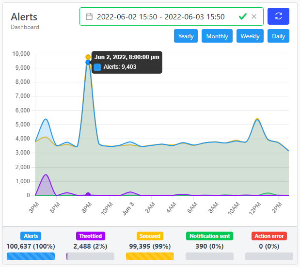

# Metrics

## Overview

SnoozeWeb has several metrics exposed by the HTTP endpoint `/metrics` in [OpenMetrics](https://openmetrics.io/) format.

### snooze_process_alert_duration

Type  
Summary

Unit  
Seconds

Average time spent processing a alert by `source`, `environment` and `severity`.

### snooze_process_alert_duration_by_plugin

Type  
Summary

Unit  
Seconds

Average time spend processing a alert by `plugin` and `environment`. Useful to track down slowness in the processing.

### snooze_alert_hit

Type  
Counter

Counter of received alerts by by `source`, `environment` and `severity`.

### snooze_alert_snoozed

Type  
Counter

Total number of alerts snoozed by the `snooze` plugin.

### snooze_alert_throttled

Type  
Counter

Total number of alerts throttled by the `aggregaterule` plugin. Alerts are grouped by aggregate rule names.

### snooze_alert_closed

Type  
Counter

Total number of alerts closed by a user.

### snooze_notification_sent

Type  
Counter

Total number of notifications sent. Grouped by notification name.

### snooze_action_success

Type  
Counter

Total number of notification actions that succeeded.

### snooze_action_error

Type  
Counter

Total number of notification actions that failed.

## Web interface

Snooze web interface has a few built-in charts displaying these metrics under its dashboard section.

### Dashboard stat counters

The dashboard reads **DB-persisted hourly counter buckets** that the server
writes as alerts flow through the pipeline. This means:

- **History is forward-only.** Counters begin accumulating from the moment the
  server first runs after upgrade. No data exists for periods before that.
- **Resolution is hourly.** Each bucket covers one clock-hour; chart points are
  aggregated from those buckets.
- **Gate:** all counter writes (and the dashboard) are disabled when
  `general.metrics_enabled` is `false`. See
  [General configuration](../configuration/general.md#metrics_enabled).

The following counter series are tracked:

| Series | What it counts |
|--------|---------------|
| `alert_hit` | Alerts that completed the processing pipeline (one increment per alert, at each terminal outcome) |
| `alert_throttled` | Alerts suppressed by an aggregate rule's throttle window |
| `alert_snoozed` | Alerts matched by a snooze filter |
| `notification_sent` | Notifications dispatched by the notification plugin |
| `action_success` | Individual notification actions that completed successfully |
| `action_error` | Individual notification actions that failed |

Each series also carries a **by-state breakdown** (open / ack / close / …) and
a **top-host breakdown** so the dashboard can surface which hosts generate the
most traffic.

### Retention

Counter buckets older than the configured retention window are pruned by the
housekeeper. The retention period defaults to **400 days** (`9600h`) and is
tunable via `housekeeping.cleanup_stats` — editable in **Settings →
Housekeeping** without a restart. See
[Housekeeper configuration](../configuration/housekeeping.md#cleanup_stats).

### Alerts chart

The time interval for displaying the metrics can be changed freely. It has a few presets and defaults to **daily**.

:::tip

Clicking on a point of the chart will redirect to the alert section showing only alerts during around this period.

Clicking on a label will filter it in/out.

Changing the time interval will also affect all other charts time interval as well.

:::

### Other charts

A few other charts are also computed:

- Alerts by Source
- Alerts by Environment
- Actions
- Throttled Alerts
- Snoozed Alerts
- Alerts by Weekday

