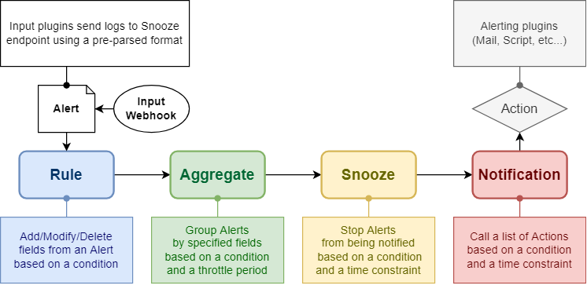
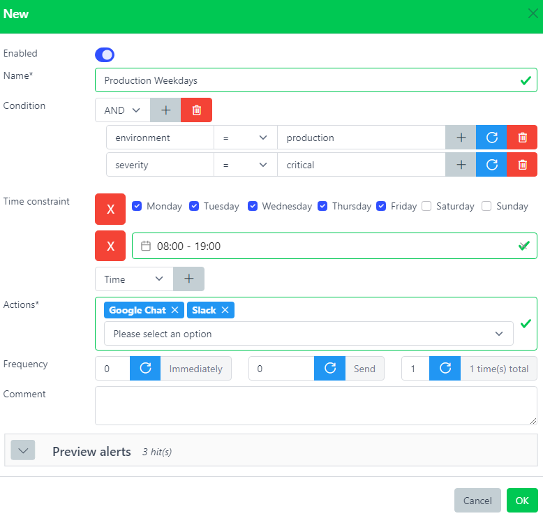

# Notifications



:::info

For the catalogue of notification destinations — Slack, Microsoft Teams, email, Google Chat, Mattermost, PagerDuty, Opsgenie, ServiceNow, Twilio, webhooks and more — see [Integrations](./integrations/index.md).

:::

Call a list of [Actions](./actions.md) which are alerting scripts.

Alerts have to match the Notification's condition and time constraint in order to being processed.

Notification is the only component relying on another one. Indeed, at least one Action has to be created first before being able to use it.

``` yaml
host: prod-syslog01.example.com
rules: ['is_production']
time_constraint: {}
environment: production
```

``` yaml
name: alert_production
condition: environment = production
time_constraint: {}
actions: ['sendmail_all'] # Assumes this action already exists
```

``` yaml
host: prod-syslog01.example.com
rules: ['is_production']
environment: production
notifications: ['alert_production']
```

The Alert matched the notification's condition and time constraint (it was empty), therefore the action `sendmail_all` will be called.

Any Alert matching a notification will have a new field `notifications` added with the list of matched notifications.

## Web interface



Name\*  
Name of the notification.

[Condition](./conditions.md)  
This rule will be triggered only if this condition is matched. Leave it blank to always match.

[Time Constraint](./timeconstraints.md)  
Time constraint during this notification will be active.

[Actions](./actions.md)  
List of actions to execute. At least one action needs to be created beforehand.

[Frequency](#frequency)  
Keep sending notifications. If acknowledged or closed, no more notification will be sent.

Comment  
Description.

### Frequency

This parameter controls how many times this notification should be triggered and at which interval. It has 3 subparameters (in order):

delay (`0`)  
Time in seconds to wait before triggering this notification the first time.

every (`0`)  
Time in seconds until the next notification trigger.

total (`1`)  
Number of total notifications sent (-1 means indefinitely)

By default a notification is immediately executed only once.

It an alert that triggered this notification gets [acknowledged](./alerts.md#acknowledge) or [closed](./alerts.md#close) before the notification is sent, no more will be sent.

``` yaml
delay (10) every (60) total (4)
# Sends a notification after 10s
# then keep sending a notification every 60s
# until 4 notifications have been sent in total

delay (0) every (10) total (-1)
# Sends a notification immediately
# then keep sending a notification every 10s
# indefinitely (will stop if someone acknowledges the alert)
```

## Alert flow: matched notifications and action outcomes

Each processed alert records the path it took through the pipeline:

- `notifications` — the names of the notification entries whose condition and
  time window matched the alert.
- `actions` — one entry per action a matched notification referenced, each with
  a `status`:
  - `success` — the notifier sent it.
  - `error` — the send failed, or the action is misconfigured (the `error`
    field carries the reason).
  - `skipped` — the notification's frequency is disabled (`total: 0`).
  - `pending` — the send is in flight (resolves to `success`/`error`).
  - `sent` — dispatched while outcome tracking is disabled (see the
    `persist_action_outcomes` flag in [Notification configuration](../configuration/notifications.md#persist_action_outcomes)).

Expand an alert in the **Alerts** view and open the **Flow** tab to see this as
a flowchart: input → rules → aggregate, then a branch for each matched
notification, each showing the actions it fired (boxes are green on success, red
on error — click a red box for the message). When a snooze rule silenced the
alert, the chart ends at the **Snooze** box (no notifications or actions).

## Federating alerts to a Snooze peer

To relay accepted alerts to a downstream Snooze (or generic HTTP) peer — for
hub-and-spoke or active/active topologies — configure a **notification** whose
action is a **Forward to another Snooze peer** (`snoozepeer`) target. See the
[Snooze peer / federation](./integrations/snoozepeer.md) integration page for the
full action-field reference.

1. Create an **action** of type *Forward to another Snooze peer* with the peer's
   endpoint (e.g. `https://hub.example.com/api/v1/alerts`) and optional
   per-peer auth (bearer / basic / apikey), TLS-verification, and timeout.
2. Create a **notification** whose **condition** scopes which accepted alerts
   relay (leave empty to relay everything) and whose **actions** list includes
   the snoozepeer action.

Relay sends the normalized post-pipeline record to the peer's
`POST /api/v1/alerts`, which re-runs its own pipeline on it. Relay is
**fire-and-forget**: a slow or failing peer never blocks or fails local
ingestion, and there are no retries (to avoid amplification storms).

### Loop prevention

In a cyclic topology (A → B → A, or a mesh of hubs) Snooze prevents infinite
relaying with the `X-Snooze-Loop` header — a comma-separated chain of the server
ids an alert has already passed through. A server that finds its own id in the
inbound chain accepts the alert but does not re-relay it. A server's id is its
`syncer.hostname`.

### HA prerequisite: distinct `syncer.hostname`

Loop detection keys on `syncer.hostname`. **Each federated node must set a
distinct `syncer.hostname`** — if two nodes share one, loop detection breaks.
Set it explicitly per node (the OS-hostname default is fragile in
container/Kubernetes deployments):

``` yaml
# syncer.yaml on node A
hostname: hub-eu
```

### Upgrading from the standalone Federation page

Earlier releases had a dedicated **Federation** admin page backed by a `forward`
collection. Federation is now a notification action. Deployments that had
`forward` destinations convert them once by running
`snooze-server migrate forward-to-action` (idempotent; safe to run on a database
with no forward destinations — it does nothing).

