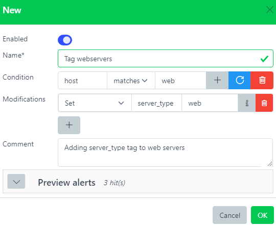
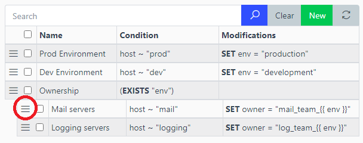

# Rules


## Overview

Add, modify or delete fields from a alert.

Alerts have to match a Rule's conditions in order to being processed.

Rules are very useful to analyze incoming alerts and add infos that were not in the original log.

``` yaml
# Alert before being processed by Rule
host: prod-syslog01.example.com
```

``` yaml
# Rule
name: is_production
condition: host MATCHES ^prod.*
modification: SET environment = production
```

``` yaml
# Alert after being processed by Rule
host: prod-syslog01.example.com
rules: ['is_production']
environment: production
```

Any alert matching a Rule will have a new field `rules` added with the list of matched Rules.

Rules resolution order is important. It allows Rules to create fields that can be used in subsequent Rules.

Rules can have an optional field called `parents` which can hold a list of Rule UIDs. These Rules will be processed only if all parents conditions have been met in the first place.

This design allowing Rules to be nested is very convenient to avoid repeating the same conditions across multiple Rules.

## Jinja templates

It is possible to use Jinja templates to render the alert's fields for any modification

*Example*: `["SET", "environment", "{{ env }}"]` will create a new field **environment** using the content of the field **env** from the same alert.

More info on [Jinja website](https://jinja.palletsprojects.com/en/2.11.x/templates/).

## Web interface



Name\*  
Name of the rule.

[Condition](./conditions.md)  
This rule will be triggered only if this condition is met. Leave it blank to always match.

[Modification](./rules.md#modifications)  
List of changes to apply to the alert.

Comment  
Description.

**Note**: Use drag&drop to change the rule's order and/or use nesting:



## Modifications

All modifications are applied in order. They provide a lot of control over incoming alerts.

List of modifications:

- [Set](#set)
- [Delete](#delete)
- [Append (to array)](#append-to-array)
- [Delete (from array)](#delete-from-array)
- [Regex parse (capture)](#regex-parse-capture)
- [Regex sub](#regex-sub)
- [Key-value mapping](#key-value-mapping)

### Set

Modify a field or create it if it does not exists.

``` json
{
    "hostname": "prod-unit01"
}
```

| modification | field       | value      |
|--------------|-------------|------------|
| SET          | environment | production |

``` json
{
    "hostname": "prod-unit01",
    "environment": "production"
}
```

This modification added a field `environment` to the alert.

### Delete

Delete a field.

``` json
{
    "name": "john",
    "password": "Ch@ng3m3!"
}
```

| modification | field    |
|--------------|----------|
| DELETE       | password |

``` json
{
    "name": "john",
}
```

This modification deleted the sensitive field `password` from the alert.

### Append (to array)

Append an element to a array typed field.

``` json
{
    "permissions": ["read"]
}
```

| modification | field       | value |
|--------------|-------------|-------|
| ARRAY_APPEND | permissions | write |

``` json
{
    "permissions": ["read", "write"]
}
```

This modification added `write` to the list of `permissions`.

### Delete (from array)

Delete the first matching element from an array typed field if it exists.

``` json
{
    "names": ["stanley", "john", "erika"]
}
```

| modification | field | value |
|--------------|-------|-------|
| ARRAY_DELETE | names | john  |

``` json
{
    "names": ["stanley", "erika"]
}
```

This modification removed `john` from the list of `names`.

### Regex parse (capture)

Parse a field with a regex. The named capture groups will be merged with the alert.

See [python regex syntax](https://docs.python.org/3/library/re.html#regular-expression-syntax) for more details on the regex named capture group syntax.

``` json
{
    "message": "CRON[12345]: my error message"
}
```

<table>
<thead>
<tr>
<th>modification</th>
<th>field</th>
<th>regex with capture groups</th>
</tr>
</thead>
<tbody>
<tr>
<td>REGEX_PARSE</td>
<td>message</td>
<td><div class="sourceCode" id="cb1"><pre class="sourceCode xml"><code class="sourceCode xml"><span id="cb1-1">(?P&lt;<span class="kw">appname</span>&gt;.*?)\[(?P&lt;<span class="kw">pid</span>&gt;)\d+\]: (?P&lt;<span class="kw">message</span>&gt;.*)</span></code></pre></div></td>
</tr>
</tbody>
</table>

``` json
{
    "appname": "CRON",
    "pid": "12345",
    "message": "my error message"
}
```

This modification splitted the field `message` into 3 more relevant fields `appname`, `pid` and `message` (overwritten).

### Regex sub

Parse a field with a regex. Substitute the matching pattern then output a new field.

``` json
{
    "message": "Wrong password: Ch@ngem3"
}
```

<table>
<thead>
<tr>
<th>modification</th>
<th>field</th>
<th>output</th>
<th>regex parse</th>
<th>sub</th>
</tr>
</thead>
<tbody>
<tr>
<td>REGEX_SUB</td>
<td>message</td>
<td>message</td>
<td><div class="sourceCode" id="cb1"><pre class="sourceCode xml"><code class="sourceCode xml"><span id="cb1-1">(password:) (.*)</span></code></pre></div></td>
<td><div class="sourceCode" id="cb2"><pre class="sourceCode xml"><code class="sourceCode xml"><span id="cb2-1">\g<span class="er">&lt;</span>1&gt; ***</span></code></pre></div></td>
</tr>
</tbody>
</table>

``` json
{
    "message": "Wrong password: ***"
}
```

This modification splitted the field `message` into 3 more relevant fields `appname`, `pid` and `message` (overwritten).

### Key-value mapping

Try to match a field with a key present in a KV. If found, output the value in a new field.

:::warning

a Key-value store has to be created beforehand. See [Key-values](./kv.md).

:::

| dictionnary | key     | value |
|-------------|---------|-------|
| roles       | john    | admin |
| roles       | stanley | user  |

``` json
{
    "name": "john"
}
```

| modification | dict  | field | output |
|--------------|-------|-------|--------|
| KV_SET       | roles | name  | role   |

``` json
{
    "name": "john"
    "role": "admin"
}
```

This modification matched `john` in the Key-value `roles`, therefore adding the field `role` with its corresponding value `admin`.

