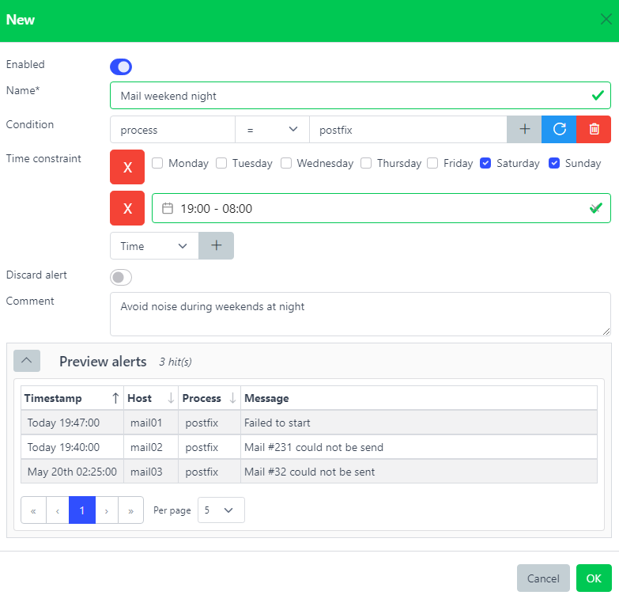

# Snooze filters


## Overview

Stop alerts from being notified.

Alerts have to match the Snooze filter's condition and time constraint in order to being processed.

Snooze filters are especially useful to reduce noise in case an alert does not need to be notified.

Several reasons could justify creating a Snooze filter. Maybe the alert was not a critical issue after all or the escalating time itself was not considered critical.

``` yaml
host: dev-syslog01.example.com
rules: ['is_development']
environment: development
timestamp: 2020-07-15 04:00:00 # Monday
```

``` yaml
name: snooze_dev
condition: environment = development
time_constraint:
    datetime:
      - from:  2021-07-01 00:00:00
        until: 2021-07-31 23:59:59
    time:
      - from:  00:00:00
        until: 00:08:00
    weekdays:
      - weekdays: [1,4] # Monday, Thursday
```

``` yaml
host: dev-syslog01.example.com
rules: ['is_development']
environment: development
timestamp: 2020-07-15 04:00:00
snoozed: snooze_dev
```

The alert matched the Snooze filter, therefore it got stopped before being executed by the next Process plugin.

Any alert matching a Snooze filter will have a new field `snoozed` added with the Snooze filter name.

## The `snoozed` field is decided on every occurrence

`snoozed` names the filter that silenced an alert, and the alerts list treats a
record carrying it as silenced. The Snooze plugin owns that field outright: it
is re-decided every time an occurrence of the alert reaches the server, and
nothing else in the server writes or removes it.

Each occurrence ends in one of these outcomes:

| The occurrence… | `snoozed` becomes |
|---|---|
| matches a filter | that filter's name |
| matches no filter — it changed, the window closed, or the filter was deleted | removed; the alert returns to the list |
| has a severity in `general.snooze_bypass_severities` | removed; that severity is never silenced |
| is a **recovery** (`close`) of an alert already on the books | left exactly as it was |

The recovery row is the deliberate exception. A filter must never suppress a
close — that would wedge the alert open forever — so the plugin passes it
straight through without re-deciding, and an alert silenced for its whole life
does not resurface at the moment it recovers.

Two consequences of keeping it:

- The recovery continues to your [notifications](./notifications.md) carrying
  `snoozed`, like any close. To avoid paging the recovery of an alert whose
  firing never paged, add `NOT snoozed EXISTS` to the notification's condition.
- The closed row keeps its attribution, but the **Snoozed** tab lists only
  alerts that are not closed; a recovered one appears under **Closed**. Its
  flow chart shows the filter that silenced it and the notifications the
  recovery reached.

This holds for occurrences an [aggregate rule](./aggregaterules.md) holds back
inside its throttle window or its anti-flapping budget, too. Those are
persisted (the `duplicates` counter has to keep moving) but not notified, and
the filter still gets the final say: a `discard` filter drops the write
outright, a tagging filter re-stamps `snoozed`.

That last point matters because aggregate throttles are often long — a day is a
common setting. Without it, an alert already on the books and repeating every
30 seconds would ignore a filter you create now for the whole rest of the
window, staying open and un-silenced in the alerts list.

One consequence to expect: a filter's **Hits** counter now counts every
occurrence it suppresses, including throttled repeats, so it climbs faster than
the number of notifications it prevented. Hits are batched and written a few
seconds after the match. The dashboard's **Snoozed** series is different: it
counts the occurrences the pipeline stopped *at* the snooze stage, so a
throttled repeat counts once, as throttled, not a second time as snoozed.

## A filter that can no longer silence releases its alerts

An alert that is still firing re-decides on its next occurrence. One that
never fires again has no next occurrence, so the Snooze plugin also clears
`snoozed` from stored alerts whose filter can no longer silence anything:

- the filter was **deleted** — through the API or web interface, or by the
  [`cleanup_snooze`](../configuration/housekeeping.md#cleanup_snooze)
  housekeeping job;
- the filter was **disabled**, or **renamed** (alerts stamped with the old
  name are released);
- the filter's absolute time window is **over** — a "snooze for 2 hours" ends
  when the two hours do, even for an alert that fired once and went quiet.

A filter whose *recurring* window is only closed right now (a nightly
maintenance slot, at noon) can still silence, so its alerts are left alone
until their next occurrence re-decides.

An API delete or edit releases alerts immediately. Everything else is caught
by the minute-cadence `reconcile_suppression` housekeeping sweep, which also
covers a cluster peer that re-stamped a filter's name just after it was
deleted.

## Web interface



Name\*  
Name of the snooze filter.

[Condition](./conditions.md)  
This rule will be triggered only if this condition is matched. Leave it blank to always match.

[Time Constraint](./timeconstraints.md)  
Time constraint during this snooze filter will be active. See [Time Constraints](./timeconstraints.md)

A filter whose condition or time constraint the server cannot parse is refused
when you save it (HTTP `422` from the API) rather than stored and silently
ignored. When writing filters through the API or a script, send datetimes as
RFC3339 with a timezone — `2026-09-21T19:01:42Z`, not `2026-09-21T19:01:42`.

Discard  
Discard alerts matching this snooze filter.

Comment  
Description.

It is possible to see how many times a alert was snoozed by checking the number on the very right. Whenever clicking on it, a list of alerts that have been snoozed by the corresponding filter will be displayed on the **Alerts** page under the **Snoozed** tab.

### Status and remaining countdown

Each row in the snooze list carries a server-computed **Status** badge and a
**Remaining** countdown, both derived at read time from the filter's
`time_constraints.datetime` window (no extra request, no stored field):

- **Status** — the lifecycle of the filter's absolute datetime window:
  - **active** (green) — the window covers the current moment; the filter is
    suppressing matching alerts right now.
  - **pending** (amber) — the window starts in the future; the filter is
    scheduled but not yet suppressing.
  - **expired** (grey) — the window has already closed; the filter no longer
    matches.
  - **always on** (blue) — no datetime constraint is set, so the filter fires
    indefinitely (weekday/time-of-day constraints do not bound the lifespan).
- **Remaining** — for an active, time-bounded filter, the time left until its
  window closes (e.g. `2h 15m`); `forever` for an always-on filter; `—` when
  there is no countdown (pending, expired, or open-ended).

The Active / Upcoming / Expired tabs use the same status: *always-on* folds
into **Active**, and *pending* maps to **Upcoming**.

### Silence for… shortcut

The editor's **Silence for…** row sets an absolute datetime window from now
without opening the date-picker — the common "quiet this host until morning"
case. Click a preset (**1h**, **4h**, **24h**, **7d**) or type a free-text
duration and press **Apply**. The free-text field accepts a sequence of
`<number><unit>` segments where unit is `d` (days), `h` (hours), or `m`
(minutes) — for example `2h`, `30m`, or `1d12h`. Invalid input is rejected
with a message and leaves the form untouched. Applying a duration replaces the
filter's single absolute datetime range with `from = now`, `until = now +
duration`; recurring windows (weekdays, daily time-of-day) still use the full
time-constraints editor below.

