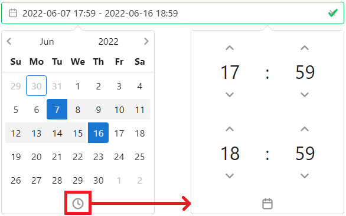
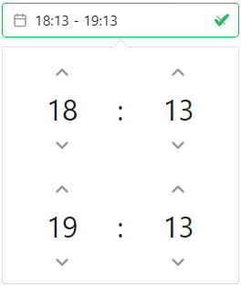

# Time Constraints

## Overview

**Time Constraints** are an additional type of control used to determine whether an alert should be processed by the corresponding plugin or not.

List of time constraints:

- [DateTime](#datetime)
- [Time](#time)
- [Weekdays](#weekdays)

When using multiple time constraints of the **same** type, **only one** needs to match for the time constraint to be matching.

When using multiple time constraints of **different** types, **all** of them need to match for the time constraint to be matching.

``` console
Time Constraint = (DateTime A OR DateTime B)
                    AND (Time A OR Time B) AND (Weekday A OR Weekday B)
```

:::warning

Starting time begins at 0 second. Ending time finishes at 59 seconds. For example, `04:30 - 07:29` representation starts at `04:30:00` and ends at `07:29:59`

:::

### DateTime

In `Year-Month-Day Hour(24):Minute` format, **DateTime** is the only time representation that actually expires.

``` yaml
datetime:
  - from: 2022-01-01 00:00
    until: 2022-01-31 23:59
  - from: 2022-05-01 00:00
    until: 2022-05-31 23:59
```

Alerts matching this time constraint need to have their timestamp in January 2022 or in May 2022.

#### Web interface



To select a range, click on the starting date then on ending date on the calendar. Time can be set by clicking on the clock icon. To select a 1 day range, click on a date twice (the selected area should become a square)

:::tip

Hint

:::

DateTime and Time can be copy pasted or manually inputted using the keyboard.

### Time

In `Hour(24):Minute`, **Time** by itself represents a daily interval.

``` yaml
time:
  - from: 04:00
    until: 07:59
  - from: 16:00
    until: 19:59
```

Alerts matching this time constraint need to have their timestamp between 04:00:00 and 07:59:59 or between 16:00:00 and 19:59:59

#### Web interface



### Weekdays

Accepts a list of numbers matching their corresponding weekday. Weeks start on Sunday (0)

``` yaml
weekdays:
  - weekdays: [0, 1]
```

Alerts matching this time constraint need to have their timestamp in Sunday or Monday

#### Web interface


