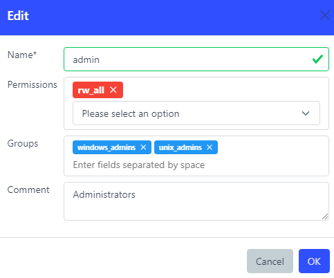
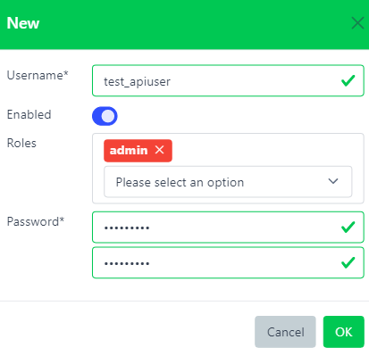
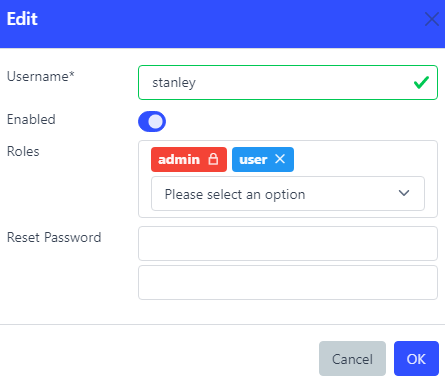

# User creation and permissions

Only authenticated users with sufficient permissions can interact with Snooze server. Permissions are given to users by assigning them Roles.

## Roles

Name\*  
Name of the role.

Permissions  
List of permissions granted by the role.

Groups  
List of groups provided by the authentication backend. If a user successfully logs in and is a member of a group, this role will get automatically assigned to the user. See [Static Roles](./users.md#static-roles)

Comment  
Description

### Permissions

Explanation of all default permissions:

rw_all  
Read and Write for All. Full privileges on any resource in Snooze server.

ro_all  
Read Only for All. Can view everything but cannot add/edit/delete anything.

rw_X  
Read and Write for X. Full privileges on resource X.

ro_X  
Read Only for X. Can view everything on resource X but cannot add/edit/delete it.

rw_tenant  
Read and Write for the **tenant registry**. Allows creating, updating, and
deleting tenant documents via `/api/v1/tenant`. This is a **platform-tier**
permission, independent of any specific tenant. Carried by the
`platform_admin` role.

ro_tenant  
Read Only for the **tenant registry**. Allows listing and inspecting tenant
documents. Also a platform-tier permission.

can_comment  
Allow to acknowledge, re-escalate or comment any received alert. [More on Alerts](./alerts.md)

### The `platform_admin` role

A special seeded role named `platform_admin` is created at first boot. It
holds `rw_tenant` and `ro_tenant`. The root user is assigned this role at
bootstrap. Assign `platform_admin` to any user who needs to manage
organizations in a multi-tenant deployment.

Platform-tier permissions are checked against **platform scope** — they gate
only `/api/v1/tenant` routes and are not evaluated for per-tenant plugin
CRUD. A user can hold `platform_admin` in addition to per-tenant roles such
as `admin` or `viewer`.

See [Tenant management](./tenant_management.md) for the operator workflow.

## Users

Username\*  
Account username.

Roles  
List of roles assigned to the user.

Password\*  
When creating a user, this field is required to set up the user's first password. When editing a user, leave it blank to apply no changes to it. Note: for LDAP users, passwords are not displayed.

### Static Roles

Roles that automatically assigned to a user because of their group membership coming from the authentication backend will appear as locked. They cannot be removed unless either the Role's groups are changed or the user's group membership is changed.

