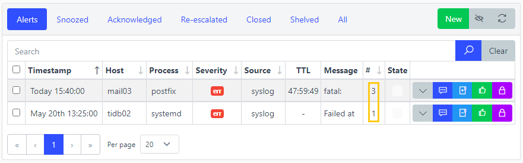

.. _aggregate_rules:

===============
Aggregate Rules
===============

.. figure:: images/architecture.png
    :align: center

    Architecture - Aggregate Rules plugin

Overview
========

Group Alerts based on matching fields and a throttle period.

Alerts have to match the Aggregate's condition in order to being processed.

Aggregate rules are mainly designed to prevent similar Alerts from being notified especially if they were sent in burst or the process generating them was flapping.

.. code-block:: yaml
    :caption: Example

    # Alert A
    host: prod-syslog01.example.com
    process: sssd[2564]
    message: Preauthentication failed
    timestamp: 2021-01-01 10:00:00

    # Alert B
    host: prod-syslog01.example.com
    process: sssd[2566]
    message: Preauthentication failed
    timestamp: 2021-01-01 10:10:00

    # Alert C
    host: prod-syslog01.example.com
    process: sssd[2569]
    message: Preauthentication failed
    timestamp: 2021-01-01 10:20:00

.. code-block:: yaml

    # Aggregate rule
    fields:
        - host
        - message
    throttle: 900 # 15 mins

All three alerts have the same fields ``host`` and ``message``.

Alert A being the first one processed, it was correctly passed to the next Process plugin. The throttle period started from Alert A timestamp.

Alert B was processed 10 minutes after Alert A which was lower than the throttle period (15 mins), therefore Alert B was not passed to the next Process plugin.

Alert C was processed 20 minutes after Alert A which was greater than the throttle period, therefore Alert C was correctly passed to the next Process plugin. The throttle period restarted from Alert C timestamp.

**Note**: On the web interface, it is possible to see how many times an alert was aggregated by checking the number on the very right on **Alerts** page:

Watch
=====

Normally, during the throttle period, subsequent alerts would not be notified. It is possible though to bypass this behavior by setting up watched fields.

If a new incoming alert that would be aggregated has one of its watched fields changed, the throttle period will be reset and the alert will be notified.

.. code-block:: yaml
    :caption: Example

    # Alert A
    host: prod-syslog01.example.com
    severity: critical
    timestamp: 2021-01-01 10:00:00

    # Alert B
    host: prod-syslog01.example.com
    severity: emergency
    timestamp: 2021-01-01 10:10:00

.. code-block:: yaml

    # Aggregate rule
    fields:
        - host
    watch:
        - severity
    throttle: 900 # 15 mins

Since ``severity`` has been set as a watched field, Alert B which would usually not be notified because of the throttle period is getting notified (critical -> emergency).

Flapping
========

Even during the throttle period, closed alerts getting new hits are being re-opened and therefore notified. However, an anti-flapping feature is present to cap the number
of the times this behavior can happen. by default it is set to 3, meaning only 3 subsequent hits can be notified until the throttle period ends.

Web interface
=============

.. image:: images/web_aggregaterules.png
    :align: center

:Name*: Name of the aggregate rule.
:|condition|: This aggregate rule will be triggered only if this condition is matched. Leave it blank to always match.
:Fields: Space separated fields used to group incoming alerts.
:Watch: Space separated fields used to bypass the throttle period if they get updated.
:Throttle: Number of seconds to wait before escalating the next alert matching this aggregate rule (-1 for infinite).
:Flapping: Maximum number of times to be alerted during the throttle period.
:Comment: Description.

.. |condition| replace:: :ref:`Condition <conditions>`
