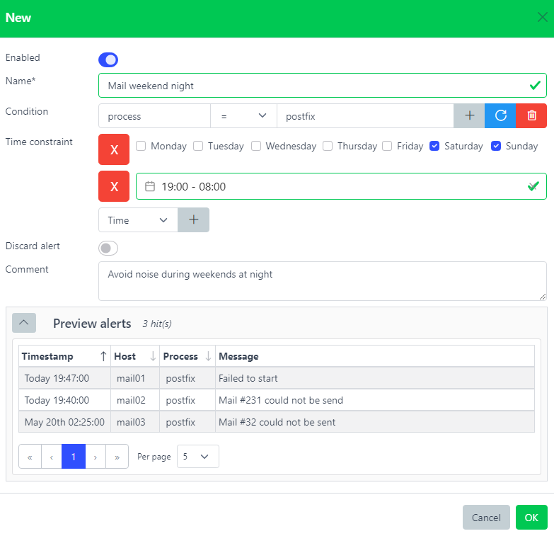

.. _snooze_filters:

==============
Snooze filters
==============

.. figure:: images/architecture.png
    :align: center

    Architecture - Snooze filters plugin

Overview
========

Stop alerts from being notified.

Alerts have to match the Snooze filter's condition and time constraint in order to being processed.

Snooze filters are especially useful to reduce noise in case an alert does not need to be notified.

Several reasons could justify creating a Snooze filter. Maybe the alert was not a critical issue after all or the escalating time itself was not considered critical.

.. code-block:: yaml
    :caption: Alert before being processed by Snooze filters

    host: dev-syslog01.example.com
    rules: ['is_development']
    environment: development
    timestamp: 2020-07-15 04:00:00 # Monday

.. code-block:: yaml
    :caption: Snooze filter

    name: snooze_dev
    condition: environment = development
    time_constraint:
        datetime:
          - from:  2021-07-01 00:00:00
            until: 2021-07-31 23:59:59
        time:
          - from:  00:00:00
            until: 00:08:00
        weekdays:
          - weekdays: [1,4] # Monday, Thursday

.. code-block:: yaml
    :caption: Alert after being processed by Snooze filters

    host: dev-syslog01.example.com
    rules: ['is_development']
    environment: development
    timestamp: 2020-07-15 04:00:00
    snoozed: snooze_dev

The alert matched the Snooze filter, therefore it got stopped before being executed by the next Process plugin.

Any alert matching a Snooze filter will have a new field ``snoozed`` added with the Snooze filter name.

Web interface
=============

:Name*: Name of the snooze filter.
:|condition|: This rule will be triggered only if this condition is matched. Leave it blank to always match.
:|time_constraint|: Time constraint during this snooze filter will be active. See :ref:`Time Constraints <time_constraints>`
:Discard: Discard alerts matching this snooze filter.
:Comment: Description.

.. |condition| replace:: :ref:`Condition <conditions>`
.. |time_constraint| replace:: :ref:`Time Constraint <time_constraints>`

It is possible to see how many times a alert was snoozed by checking the number on the very right.
Whenever clicking on it, a list of alerts that have been snoozed by the corresponding filter will be displayed
on the **Alerts** page under the **Snoozed** tab.
