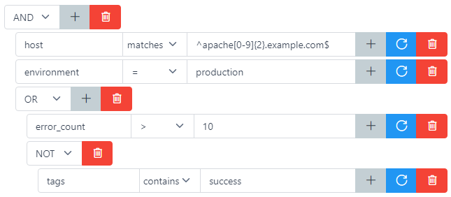

.. _conditions:

==========
Conditions
==========

Overview
========

Conditions are used by all process plugins. It is only when a condition is ``true`` that a process plugin gets executed.
Conditions can also be used for searching in the web interface. A :ref:`query language <query_language>` has been created to facilitate writing them.
Empty conditions are ``always true``

A basic condition is formed with a :ref:`keyword <keyword>`, a ``field`` and sometimes a ``value``. It is executed against each field of an alert.

Logical operators
-----------------

.. _logical_operator:

Binary operators (**AND**, **OR**) can join 2 conditions while **NOT** operator transforms the current condition.

AND
^^^

``ConditionA AND ConditionB`` is ``true`` only if ConditionA is ``true`` **and** ConditionB is ``true``.

OR
^^

``ConditionA OR ConditionB`` is ``true`` only if ConditionA is ``true`` **or** ConditionB is ``true``.

NOT
^^^

``NOT ConditionA`` is ``true`` only if ConditionA is ``false``.

Keywords
--------

.. _keyword:

Keywords are used to compare an alert's ``field`` with an expected ``value``.

.. hint::

    Nested fields can be referenced by using dot notation (.): field.nestedfield

Equals (=)
^^^^^^^^^^

``Field = Value`` is ``true`` only if the alert has the field ``Field`` and its corresponding value is exactly ``Value``.

Different (!=)
^^^^^^^^^^^^^^

``Field != Value`` is ``true`` only if the alert has the field ``Field`` and its corresponding value is not exactly ``Value``.

Greater than (>)
^^^^^^^^^^^^^^^^

``Field > Value`` is ``true`` only if the alert has the field ``Field``, its corresponding value can be compared with ``Value`` and is greater than it.

Greater or equal to (>=)
^^^^^^^^^^^^^^^^^^^^^^^^

``Field >= Value`` is ``true`` only if the alert has the field ``Field``, its corresponding value can be compared with ``Value`` and is greater or equal to it.

Lower than (<)
^^^^^^^^^^^^^^

``Field < Value`` is ``true`` only if the alert has the field ``Field``, its corresponding value can be compared with ``Value`` and is lower than it.

Lower or equal to (<=)
^^^^^^^^^^^^^^^^^^^^^^

``Field <= Value`` is ``true`` only if the alert has the field ``Field``, its corresponding value can be compared with ``Value`` and is lower or equal to it.

Matches
^^^^^^^

``Field ~ Value`` is ``true`` only if the alert has the field ``Field`` and its corresponding value regex matches ``Value`` (case insensitive).

Exists
^^^^^^

``Field ?`` is ``true`` only if the alert has the field ``Field``.

Contains
^^^^^^^^

``Field contains Value`` is ``true`` only if the alert has the field ``Field`` and if either of the following is ``true``:

* The field corresponding value is a **string** and ``Value`` is a substring of it.
* The field corresponding value is an **array** and ``Value`` is an element of it.

Search
^^^^^^

``search Word`` is ``true`` only if ``Word`` appears in any of the alert's fields or values.

.. caution::

    Search keyword should avoid being used too frequently as it is a lot more compute intensive than other keywords.

Web interface
=============

Since an empty condition is ``always true``, the first click on [+] button will create a basic condition.

A click on a basic condition [+] button will add another condition separated by a :ref:`binary operator <logical_operator>`.

A click on a :ref:`binary operator <logical_operator>` [+] button will add another condition under the same operator.

A click on the blue button will clear the basic condition.

A click on a basic condition delete button will delete it. If it was the second to last remaining children of a :ref:`binary operator <logical_operator>`,
the operator will get deleted as well to only display its remaining child.

A click on a :ref:`logical operator <logical_operator>` delete button will delete all its children.
